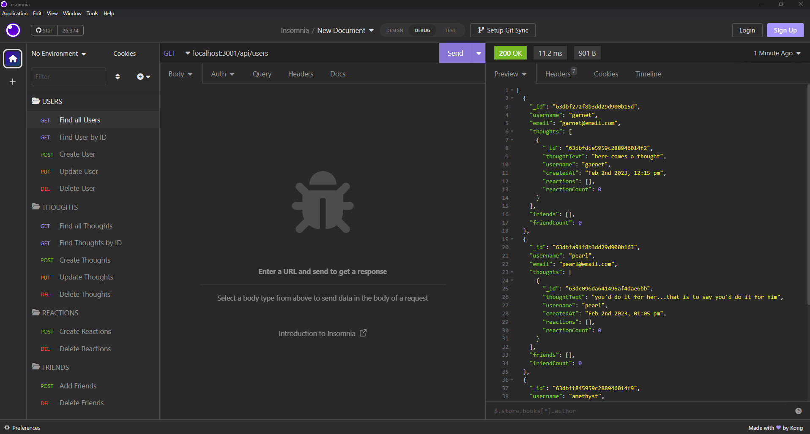

# Social Network API
Module 18 Challenge

[Social Network API Demonstration](https://drive.google.com/file/d/1V6boYwXmaUKc6MbCDFlly376WQVBu1YU/view)

## Description
This API is used as a social network directory. With this, you can create new users, find and add friends, share your thoughts, react to your friends thoughts, and more.

## Installation
Run npm install, add [Express](https://www.npmjs.com/package/express), [Mongoose](https://www.npmjs.com/package/mongoose), and [Moment](https://www.npmjs.com/package/moment) as dependencies, then run npm start and your localhost will be up and running.
